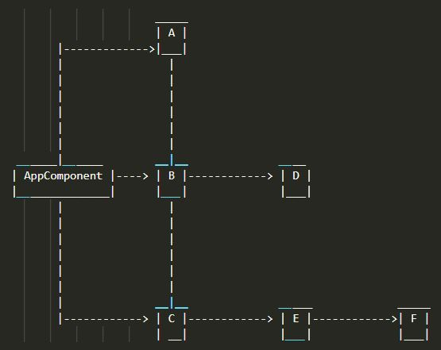
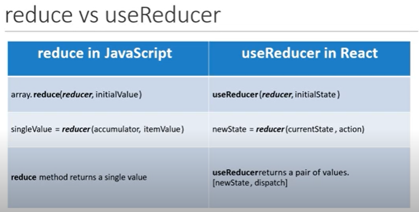
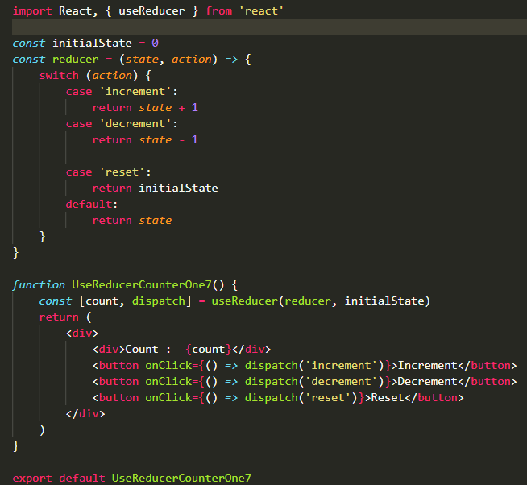
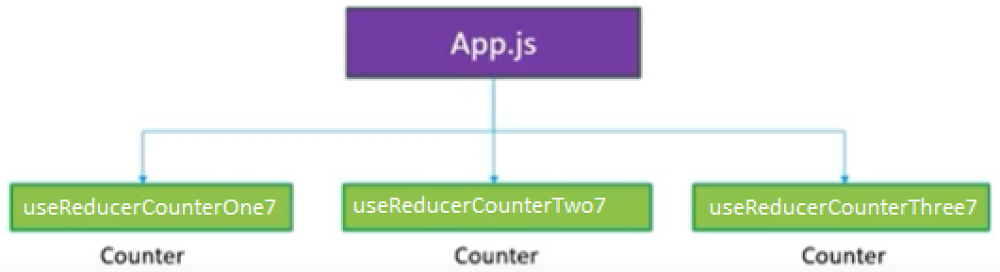
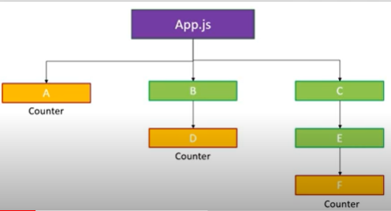

## React Hooks

### `What is React Hooks?`
*   Its a new feature added in version 16.8. which allow you to use React fetures without having to write a class.
    Ex: State of a component. Previosly versions before 16.8 State and Props are accessiable in Class Components.
*   Hooks wont work inside classes.

### `Rules while using Hooks?`
*   Only call Hooks at the Top Level
    - Dont call Hooks inside loops, conditions, or nested functions.
*   ONly call Hooks frm React Functions
        - Call them from with in Reac functional components and nit hust regular JavaScript function.

### `Why React Hooks?`
    
*   Uderstand how `this` keyword works in JavaScript.
*   Remember to bind event handlers in class components.
*   Classes dont minify very well and make ht reloading very unreliable.

*   There is no particular way to reuse stateful component logic.
*   HOC and render props patterns do address this problems.
    - Previously we are sharing the data across the components by wrapping HOC component.
*   There is need a to share stateful logic in better way.
    - Now we can share the logic accross the components in different & easy way.

*   Create components for complex scenarios such as data fetching and subscribing to events.
*   Related code is not organized in one place.
    Ex: Data fetching: In componentDidMount and componentDidUpdate
    Ex: Event listeners : In componentDidMount and componentDidUnmount
*   Because of stateful logic - Cannot break components into smaller ones.
*   With the use of useState Hook, the state doesn't have to be an object. It can be any type like number, boolean, array, string... ect.,.
*   useState hook returns an array with 2 elements:
    - 1st element is current value of the state
    - 2nd element is a state setter function
*   If the New state value depends on the previous state value? You can pass a function to the setter function.
*   When deling with objects or arrays, always make sure to spreadyour state variable and then call the setter function.
### `useState Hook`

*   Previously if you want to use state in component you need to Class.`eject`
*   Now we can use state in Funcional Components with the help of  `useState`.
    Ex: Lets see an example 1st in Class Component and same thing convert it into Function Component using useState.
*   Import useState from 'react' and call the  useState() in function.
    - This Hook / Function accepts the initial value of the state propery and returns current value of the state property and the method that is capable of updating that state property.
        Ex: const [count, setCount] = useState(0)
            -> count is the variable that accepting initial value 0.
            -> setCount is the function we are creating using useState.
        *   __Refer__:
           * __ClassuseStateCounter1.js__
           * __HookuseStateCounter1.js__

### `useState with previous state`
*   Here will see how to set state using previous value
*   __Refer__: 
    * __HookuseStateCounter2.js__

### `useState with object`
*   useState will not automatically merge the object value changes. To achieve this in useState we need to use spread operator(...)
    Ex:
    ```javascript
         `<input type='text' value={name.firstName} onChange={e => setName({ ...name, firstName: e.target.value })} ></input>`
        `- { ...name, firstName: e.target.value }` this expression explains,Copy every property in the 'name' object and then just override the firstName field in the 'name' object. 
    ```
*   setState in class components will merge the oject change automatically.
*   __Refer__: 
    *   __HookuseStateObjectCounter3.js__

### `useState with array`
*   useState will not automatically apped the object in the list using set statement. To achieve this need to use spread operator(...)
    Ex:
        
    ```javascript
        setItems([...items, {
                id: items.length,
                value: Math.floor(Math.random() * 10) + 1
            }
       ])
       ```
 *  __Refer__: 
    *   __HookuseStateArrayCounter4.js__

### `useEffect`
*   The Effect Hook lets you perform side effects in functional Components.
*   It is a close replacement for `componentDidMound, comonentDidUpdate and componentWillUnmout`
*   useEffect accepts 1 parameter as a function, this function executed after every render of the component.
*   This function triggers for evey change in the component. It create performance issue.
*   We can do conditionally trigger the useEffect() function.
    - useEffect accepts 2nd argument also as an array. This array we need to provide the props and state for which propry changes useEffect() executes.
*   Still we can make to run useEffect() only once. For this we just need to pass empty array [] in 2nd argument
    Ex:   
    ```javascript
          useEffect(() => {
                console.log(`UseEffectFuncCompRunOnce5: useEffect called`)
                window.addEventListener('mousemove', logMousePosition)
            }, [])
        ```
*   We can unmount the component using useEffect() function, same like in Class Components we use to call componentWillUnmout() to unmount the componet.
*   useEffect() function having retruns function, here we can unmount the component or subscriobtion events
        Ex: 
    ```javascript
            useEffect(() => {
                console.log(`UseEffectFuncCompRunOnce5: useEffect called`)
                window.addEventListener('mousemove', logMousePosition)

                return () *   { // This is for Unmounting
                    console.log(`UseEffectFuncCompRunOnce5: useEffect Unmounting`)
                    window.removeEventListener('mousemove', logMousePosition)

                }
            }, [])
    ```            
*   __Refer__: 
    *   __UseEffectClassComponent5.js__
    *   __UseEffectFuncComponent5.js__
    *   __UseEffectFuncCompRunOnce5.js__
    *   __UseEffectIntervalHook5.js__
           
### `Fetching data with useEffect`
*   Let see how to fecth data from end poing inside useEffect(). One thing need to remember in future we have new feature called `Suspence` which iresponsiable for data fecthing.
*   First install `axios`. `(cmd: npm install axios)`
*   Here am going to use online API call for data fetching `(url: https://jsonplaceholder.typicode.com/ & https://jsonplaceholder.typicode.com/posts)`
*   While calling API inside the useEffect() dont forget to specicy 2nd argument for dependency list with empty array. If not it will keep calls the API infinite times.
        Ex:
    ```javascript
        
         useEffect(() => {
                axios.get('https://jsonplaceholder.typicode.com/posts').then(
                    response => {
                        console.log(response.data)
                        setPosts(response.data)
                    }
                ).catch(error => {
                    console.log(error)
                })
                return () => {

                }
            }, [])
    ```
*   Let's see how to do  Post call
            Ex: 
    ```javascript
                const [ID, setID] = useState(1)
                const [displayData, setDisplayData] = useState({})
                useEffect(() => {
                    axios.get(`https://jsonplaceholder.typicode.com/posts/${ID}`).then(
                        response => {
                            console.log(response.data)
                            setDisplayData(response.data)
                        }
                    ).catch(error => {
                        console.log(error)
                    })
                    return () => {
                        // cleanup
                    }
                }, [ID])
                const setIDFunc = (e) => {
                    setID(e.target.value)
                }
                return (
                    <div>
                        <label>Enter ID to fetch data: </label>
                        <input type='text' onChange={setIDFunc} value={ID} />
                        <table >
                            <thead>
                                <tr>
                                    <td>
                                        ID
                                </td>
                                    <td>
                                        Title
                                </td>
                                </tr>
                            </thead>
                            <tbody>
                                <tr>
                                    <td>
                                        {displayData.id}
                                    </td>
                                    <td>
                                        {displayData.title}
                                    </td>
                                </tr>
                            </tbody>
                        </table>
                    </div>
                )
    ```
### `useContext`
*   In Class component perviosly we are sharing the data to nested component with out sharing to middle component using Context.
    - Context provides a way to pass through the component tree without having to pass props down manually at each level.
*   __Refer__ the code for how to use Contex in Class Component [React Context](https://github.com/PrasanthReddy-Chittapu6683/ReactJs-V16.13.1/blob/master/reactjs-my-learnings/reactJs.txt)




                   
#### `Steps to use Context object in Class Component`
* `Step 1`: Create the context and export it
  * `export const UserContext = React.createContext();  in APP.js` 
* `Step 2`: Wrap ComponentC6 with Context object provider `UserContext.Provider` and pass username as props 
  * ```javascript
        ` <UserContext.Provider value={'PRCV'}>
                <ComponentC6></ComponentC6>
           </UserContext.Provider>`
    ```


* `Step 1`: Create the context and export it
     * `export const UserContext = React.createContext();  in APP.js`  
* `Step 2`: Wrap ComponentC6 with Context object provider `UserContext.Provider` and pass username as props 
     * ```javascript
        ` <UserContext.Provider value={'PRCV'}>
            <ComponentC6></ComponentC6>
          </UserContext.Provider>` 
       ```
* `Step 3`: Import Context object in ComponentF6 component and retreive username props using `UserContext.Consumer` 
     * ```javascript
            `return (
                <div>
                    <UserContext.Consumer>
                        {
                            user => {
                                return <div> User Context value {user}</div>
                            }
                       }
                    </UserContext.Consumer>
                </div>
            )` 
       ```
#### `Steps to use useContext() HOOK object ` 
* `Step 1`: Import the `UserContext` & `LanguageContext` object in to ComponentE.js file from App.js 
* `Step 2`: Import `useContext` from `react` in `ComponentF6.js` 
* `Step 3`: create object of useContext() by passing `UserContext` & `LanguageContext` as an argument 
     * ` Ex: const User_Context = useContext(UserContext)
             const Language_Context = useContext(LanguageContext)`
* `Step 4`: Just use the const values in JSX 
    * Ex:   ```javascript 
                `<div> {Language_Context}, {User_Context}</div>`    
            ```

*   __Refer__:
    *   __`useContext` folder__


#### `useReducer() HOOK`

*   It is used for state management.
*   It is an alternative for `useState`  
*   useReducer is related to reducer functions.
*   Accepts a reducer of type (state, action) => newState, and returns the current state paired with a dispatch method.
*   useReducer is usually preferable to useState when you have complex state logic that involves multiple sub-values or when the next state depends on the previous one. useReducer also lets you optimize performance for components that trigger deep updates because you can pass dispatch down instead of callbacks.
*   useReducer accepts 2 parameter `useReducer(reducer, initialState)`
*   reducer accepts 2 parameter `reducer(currentState, action)`
*   What is the difference b/w `useState &  useReducer`?
    *   useState is build using useReducer
*   When to use `useReducer vs useState`?
    *   NA
*  ##### Lazy initialization:
    *   You can also create the initial state lazily. To do this, you can pass an init function as the third argument. The initial state will be set to init(initialArg).
##### Hooks so far
*   useState - state
*   useEffect - side effects
*   useContext - context API
*   useReducer - reducer


*   Code for useReducer implementation
    *   
*   In this we can access both state & action as an objects
    *   Ex: 
    ```javascript  
            const initialState = {
                firstCounter: 0,
                secondCounter:0 
            }
            const reducer = (state, action) => {
                switch (action.type) {
                    case 'increment':
                        return { ...state, firstCounter: state.firstCounter + action.ValId }
                    case 'decrement':
                        return { ...state, firstCounter: state.firstCounter - action.ValId }
                    case 'increment2':
                        return { ...state, secondCounter: state.secondCounter + action.ValId }
                    case 'decrement2':
                        return { ...state, secondCounter: state.secondCounter - action.ValId }

                    case 'reset':
                        return initialState
                    default:
                        return state
                }
            }
     ```
    *   In the above code we are using spread operator `...state`, this is using for merging the state value because we are having two properties inside the object and we are going to udpate individually. 
*   By using `action` as an object we can able to pass additional data to the `reducer()` function.
*   By using `state` as an object we can able to keep tack with multiple state variables.
*   This approach maintaining multiple variables in a single state object is known as `local State`
*   There is another way to deal withe multiple variables in single object is known as  `Global State`
*   When detaling with multiple state transission, its good idea to have multiple useReducers() making use of same reducer function, This prevents comlexity of code and duplicating the reducer function
    *   Ex:
    ``` javascript
        const [count, dispatch] = useReducer(reducer, initialState, init)
        const [countTwo, dispatchTwo] = useReducer(reducer, initialState)

         return (
        <div>
            <div>Count :- {count}</div>
            <button onClick={() => dispatch('increment')}>Increment</button>
            <button onClick={() => dispatch('decrement')}>Decrement</button>
            <button onClick={() => dispatch('reset')}>Reset</button>
            <div>Count Two :- {countTwo}</div>
            <button onClick={() => dispatchTwo('increment')}>Increment2</button>
            <button onClick={() => dispatchTwo('decrement')}>Decrement2</button>
            <button onClick={() => dispatchTwo('reset')}>Reset2</button>
        </div>
    )
    ```
*   __Refer__:
    *   __`useReducerCounterOne7.js`__
    *   __`useReducerCounterTwo7.js`__
    *   __`useReducerCounterThree7.js`__


#### `useReducer with useContext HOOK`

*   useReducer is for `Local State Management` ie., at component level
*   What if we want to share the data between components ie., `Global State Management`?
    * We can do this by combining useReducer + useContext
*   For example in these 3 components( __`useReducerCounterOne7.js`__ ,   __`useReducerCounterTwo7.js`__ ,   __`useReducerCounterThree7.js`__) we are displaying Counter values (increment, decrement & reset) by duplicating the same logic in all components. Now we can make use of useContext and share the counter logic accross the components.
    *   
*   Lets build logic and create the structure as below hierarchy
    *   
*   There are two steps to achieve this
    *   `Step 1`: Creater a counter logic in App.js using useReducer() Hook.
    *   `Step 2`: Provide and consume the counter context in the required component.

#### `Fetch data from API using useReducer()`
*   Previously we have done fetching the data though API call in useEffect() Hook. Let do the same using useReducer() Hook
*   There are 4 steps to implement this
    *   `Step 1`: Add necessary Import
        *   Ex:
        ``` javascript
            import React,{useReducer,useEffect} from 'react'
            import axios from 'axios'
        ```
    *   `Step 2`: Decalre intial state `initialState` and defined `reducer` function
        ``` javascript
            /** Here we are grouping the variabled into single object*/
            const initialState = {
                loading: true,
                error: '',
                post: {

                }
            }
            const reducer = (state, action) => {
                switch (action.type) {
                    case 'FETCH_SUCCESS':
                        initialState.error = ''
                        initialState.loading = false
                        initialState.post = action.payload
                        return initialState

                    case 'FETCH_ERROR':
                        initialState.error = 'Some thing went wrong'
                        initialState.loading = false
                        initialState.post = {}
                        return initialState

                    default:
                        return initialState
                }
            }
        ```
     *   `Step 3`: Do API in useEffect hook and create useReducer Hook
         ``` javascript
            const [state, dispatch] = useReducer(reducer, initialState)
            /** 2nd parameter we are passing empty array because we need to call this function only once. ie., we are replicating componentDidMount() method */
            useEffect(() => {
                axios.get(`https://jsonplaceholder.typicode.ecom/posts/1`)
                    .then(response => {
                        dispatch({ type: 'FETCH_SUCCESS', apiResponse: response.data })
                    }).catch(error => {
                        dispatch({ type: 'FETCH_ERROR' })
                    })
                return () => {


                    // cleanup
                }
            }, [])
         ```
     *   `Step 3`: Render JSX
         ``` javascript
             return (
                <div>
                    {state.loading ? 'Loading ... Please wait' : state.post.title}
                    <b style={{ color: 'orangered' }}> {state.error ? state.error : null} </b>
                </div>
            )
         ```

#### ` useState() vs useReducer()`

Senario | useState | useReducer
------------ | ------------- | -------------
Types of state | Number, String, Boolean | Object or Array
No of State transitions | One or Two variables | Too many variables
Related State transitions? | No | Yes
Business Logic  | No business logic | Comlpex business logic
Local vs Global state   | Local | Global
         
 

